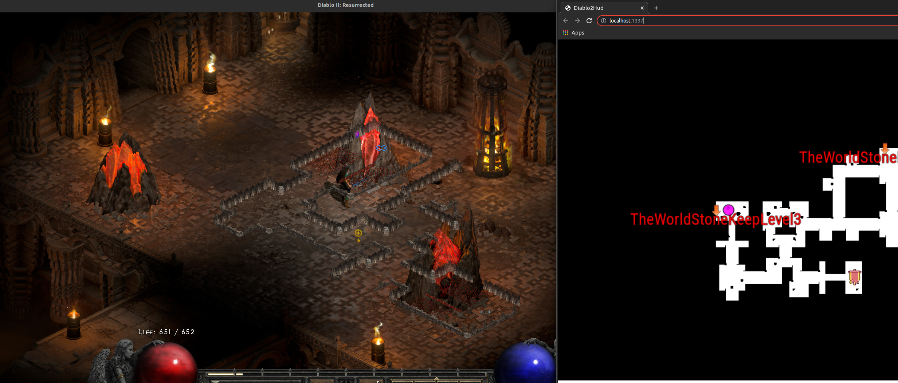
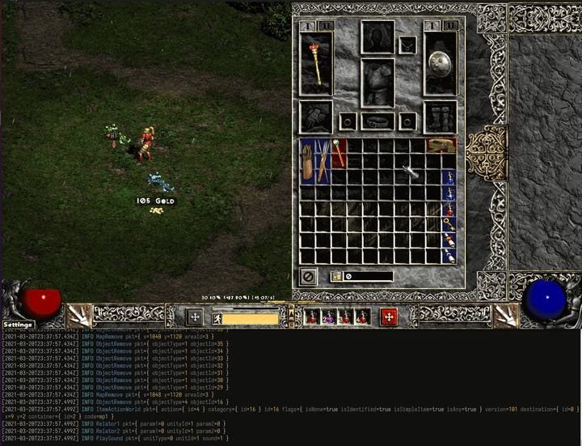
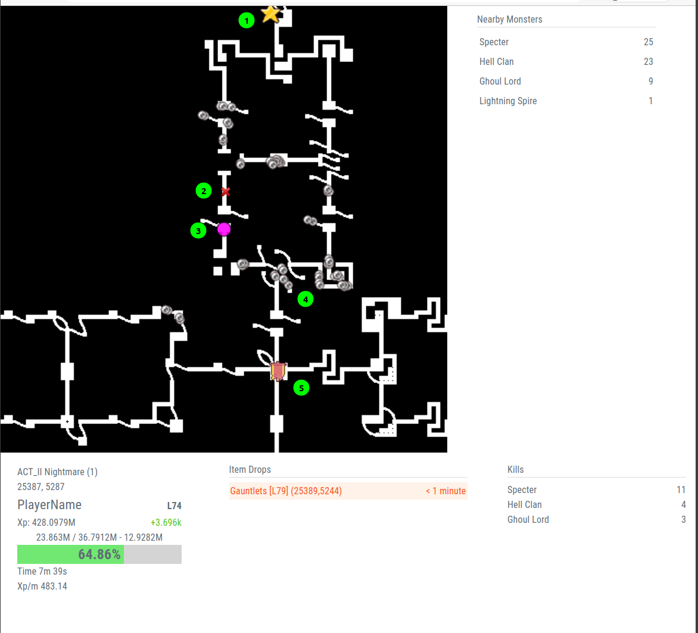

# @diablo2

[](https://github.com/blacha/diablo2/actions)

Tools to work with diablo2 

- [bintools](./packages/bintools) - Diablo2 (Classic) Binary parsers to read the `.bin` files  
- [huffman](./packages/huffman) - Diablo2 (Classic) Decompressor for network data
- [packets](./packages/packets) - Diablo2 (Classic) network protocol
- [mpq](./packages/mpq) - MPQ reader / extractor
- [map](./packages/map) - Diablo2 (Classic & Resurrected)  map generation api (Docker based) 
- [sniffer](./packages/sniffer) - Diablo2 (Classic) network sniffer
- [memory](./packages/memory) - Diablo2 (Resurrected) Memory reader

## Diablo2 Resurrected 



## Diablo2 Classic
### Packet sniffer




### Packet sniffing heads up display

Sniffs packets from the game client to create a overview of the world around.



1. Location of the summoner
2. Where a good item was drooped (Unique Frost burns)
3. Player Location
4. A collection of monsters
5. Way point

## Building


Building with yarn

```
yarn
yarn build
```